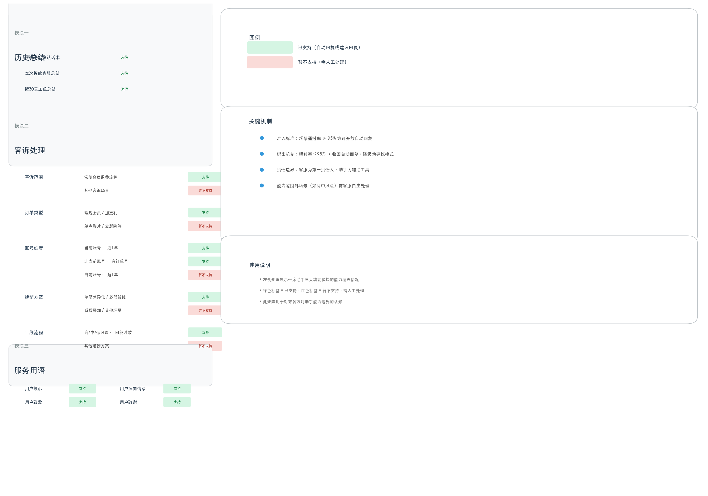
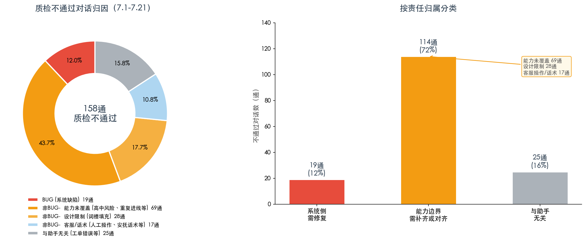

# 坐席助手能力评估报告

> 报告周期：2026年4月—7月（数据截至7月21日，并发数据截至7月28日）
> 报告目的：对齐管理层、使用方、质检方对坐席助手能力与边界的认知
> 报告方：客服中心系统规划组

---

## 一、坐席助手是什么

坐席助手是在线客服系统中的 AI 辅助工具。核心定位是：

> **帮助客服更高效地完成打字和流程操作。**

助手提供两种工作模式：

| 模式 | 说明 | 适用条件 |
|------|------|---------|
| **自动回复** | 助手直接向用户发送消息，无需客服点击 | 场景准确率 ≥ 95% |
| **建议回复** | 助手生成参考话术，由客服判断后自行选择发送 | 已覆盖但准确率未达自动回复标准 |

**责任原则：客服是所有对话的第一责任人，助手是辅助工具。** 助手自动回复时，客服仍需关注对话质量，在需要时及时介入。

---

## 二、能力全景

### 2.1 能力矩阵总览

坐席助手覆盖三大功能模块，从历史总结到客诉处理到服务用语。上图清晰标注了每个子项的「支持」与「暂不支持」边界——绿色为已支持，红色虚框为暂不支持、需人工处理。

### 2.2 历史总结

在客服工作台提供两类总结卡片，帮助客服快速了解用户背景：

- **近30天工单总结**：按工单状态与账号维度去重汇总，生成问题概述及处理摘要
- **本次智能客服总结**：基于本次智能在线对话进行智能分析，提炼用户问题线索
- 在线工作台中，助手在欢迎语后自动发送确认话术，询问用户是否继续咨询此前问题

### 2.3 客诉处理

覆盖退费场景的完整链路：退费意图识别 → 初次挽留 → 账号确认 → 订单确认 → 资源挽留 → 可退则退/不可退则升级。支持常规会员订单（含基础/黄金/白金/星钻/亲情卡/芝麻GO等）及加更礼订单；当前账号近1年内订单确认、退费条件判定、资源挽留方案（单笔差异化赠送、多笔最优赠送）；高/中/低风险等级的二线回复时效方案。暂不支持单点影片、云影院、奇豆奇点、知识付费等订单类型，以及其他业务的客诉场景。

### 2.4 服务用语

针对「用户致歉」「用户致谢」「用户投诉」「用户负向情绪」四类场景，系统通过关键词匹配自动识别用户意图并回复对应服务用语，辅助客服快速应对。

### 2.5 能力准入/退出机制

每个场景的自动回复资格以**对话通过率 ≥ 95%** 为核心依据。不达标的场景收回自动回复，降级为建议模式；持续监控、动态调整。

---

## 三、效能数据

### 3.1 人效：使用助手的坐席日均多处理 15-41%

| 月份 | 试点（通/天） | 非试点（通/天） | 部门均值 | 试点 vs 非试点 |
|------|:---------:|:----------:|:------:|:-----------:|
| 5月 | 141 | 100 | 109 | **+41.0%** |
| 6月 | 141 | 118 | 127 | **+19.2%** |
| 7月 | 148 | 128 | 135 | **+15.6%** |

> 提升幅度在收窄，但试点人效并未下降（从141升至148）。是非试点也在提升（100→118→128），可能存在工具或流程的溢出效应。

### 3.2 并发负荷：助手使坐席在更高并发下维持稳定

> **说明：试点坐席（使用助手）系统并发=3，非试点坐席（未使用助手）系统并发=2。** 以下为7月28日单日每2分钟采样的负荷对比。

| 指标 | 试点（并发=3） | 非试点（并发=2） |
|------|:-----------:|:------------:|
| 平均活跃会话 | **2.1** | 1.3 |
| 平均未关闭会话 | **3.2** | 1.9 |
| 活跃达上限比例 | 49.2% | 46.1% |
| 未关闭超上限比例 | 53.6% | 38.4% |

> 试点坐席在更高并发设置下，仍维持了与非试点相近的"达上限"比例（49% vs 46%），说明助手有效吸收了第三路并发带来的工作量。同时需关注，试点坐席未关闭会话超上限的比例（53.6%）明显更高，高峰时段（9-12点）压力尤为突出——12点时段试点坐席活跃会话达上限比例达 94.7%。

### 3.3 用户满意度：差距稳定，近三周趋势向好

| 阶段 | 试点满意度 | 部门满意度 | 差距 |
|------|:-------:|:-------:|:---:|
| 第一阶段（并发=2，WK14-21） | 77.0% | 85.9% | -8.9% |
| 第二阶段（并发=3，WK22-29） | 75.2% | 83.5% | -8.3% |

两个观察：
1. 并发从2开到3后，满意度差距**没有扩大**（8.9% → 8.3%），助手回复质量未因并发增加而下降
2. 近三周试点满意度**持续回升**（WK27: 76.4% → WK28: 77.2% → WK29: 78.7%），与部门差距缩窄至 7.4%

---

## 四、服务质量分析

### 4.1 整体数据

7月1日—21日，试点坐席共质检 **1,314 通**对话，不通过 **158 通**，通过率 **88.0%**。

| 周 | 质检量 | 不通过 | 通过率 |
|----|:----:|:----:|:-----:|
| WK27 (7.1-7.5) | 420 | 47 | 88.8% |
| WK28 (7.6-7.12) | 449 | 38 | 91.5% |
| WK29 (7.13-7.19) | 373 | 67 | **82.0%** ⚠ |
| WK30 (7.20-7.21) | 72 | 6 | 91.7% |

> **WK29通过率骤降**：高中风险场景未支持导致不通过集中爆发（31通），属于能力尚未覆盖，并非助手质量恶化。该能力已于7月23日上线。

### 4.2 不通过对话归因

对全部158通质检不通过对话进行逐条分析，按原因归属分为以下三类。

| 大类 | 数量 | 占比 | 含义 |
|------|:---:|:---:|------|
| **BUG（系统缺陷）** | 19 | 12.0% | 助手确有缺陷，由技术团队修复 |
| **非BUG（能力边界）** | 114 | 72.2% | 助手正常运转，但因能力覆盖不全或设计限制导致不通过 |
| **与助手无关** | 25 | 15.8% | 人工操作问题（工单勾选错误、业务流程错误等） |

#### 🔴 系统缺陷：BUG（19通，12.0%）

| 问题类型 | 数量 | 说明 |
|---------|:---:|------|
| 多笔订单重复探寻/流程混乱 | 10 | 既定设计不以前置节点作词槽填充 |
| 回复超时/未触发业务分析 | 4 | 部分场景助手未启动分析 |
| "投诉"关键词未触发安抚 | 2 | 用户提"投诉"时未作服务用语回复 |
| 其他执行缺陷 | 3 | 语言混乱、探寻不当等 |

#### 🟡 能力边界：非BUG（114通，72.2%）

| 子类 | 数量 | 说明 | 状态 |
|------|:---:|------|:---:|
| 高中风险场景未支持 | 31 | 用户提"自杀""跳楼"等，未触发特殊安抚 | ✅ 7.23上线 |
| 词槽填充设计限制 | 28 | 不以前置节点填充，重复确认信息 | ⏳ 评估中 |
| 客服自身问题 | 22 | 答非所问、回复超时、解答错误等 | — |
| 安抚话术设计 | 13 | 随机选择安抚语，与质检要求冲突 | ⏳ 待优化 |
| 重复进线场景 | 10 | 多次进线复杂场景，助手暂不支持 | ⏳ 评估中 |
| 质检规则需适配 | 3 | 助手已覆盖的功能仍按人工SOP判定 | ⏳ 待对齐 |
| 其他 | 7 | 主动服务标准、客服关闭自动回复等 | — |

#### ⚪ 与助手无关（25通，15.8%）

工单勾选错误（20通）、业务流程错误、承诺退费未操作等。

### 4.3 待关注：客服未干预的对话

158通不通过对话中，有 **23 通（14.6%）** 客服全程未干预。

| 类别 | 未干预数 | 标记为需关注 |
|------|:-----:|:-------:|
| BUG | 8 | 2 |
| 非BUG | 15 | 10 |

> 助手是辅助工具，客服需在助手运行过程中关注对话，及时介入。

---

## 五、能力边界与责任划分

### 5.1 三方协作

| 责任方 | 负责内容 |
|--------|---------|
| **系统侧** | BUG修复、新能力开发、自动回复准入/退出管理 |
| **客服侧** | 对话第一责任人，关注助手回复，在需要时介入 |
| **质检侧** | 与系统侧对齐规则，AI辅助场景的判定标准适配 |

### 5.2 不同场景下的处理方式

| 对话场景 | 助手行为 | 客服需做的 |
|---------|---------|---------|
| 能力范围内 + 达标 | 自动回复 | 关注对话，需要时介入 |
| 能力范围内 + 不达标 | 已收回自动回复，仅建议 | 自行判断回复 |
| 能力范围外 | 不回复或建议 | 自主处理 |
| 助手出错（BUG） | 可能错误回复 | 及时介入并反馈 |

### 5.3 几点提醒

1. 助手自动回复时，客服需关注对话内容
2. 对助手不支持的场景（如高中风险），需客服自主处理
3. 在助手能力范围外的场景请勿依赖助手

---

## 六、对质检规则的建议

部分质检规则为纯人工场景设计，AI辅助下需重新定义判定标准。

| 质检规则 | 当前情况 | 建议方向 |
|---------|------|---------|
| **重复探寻** | 助手因词槽填充设计限制，前置节点已确认的信息仍会重复询问 | 区分设计限制导致的合理重复与能力缺陷导致的不合理重复 |
| **安抚"更换方式"** | 助手随机选择安抚话术，质检要求"更换安抚方式" | 助手场景下，使用不同话术即视为有效 |
| **退费未走SOP** | 助手已自动判定退费条件，人工无需重复SOP | 助手已覆盖环节，人工不判定为未走SOP |

---

## 七、后续行动

### 7.1 技术侧

| 优先级 | 行动 | 预期影响 |
|:---:|------|------|
| P0 | 修复多笔订单重复探寻/流程混乱 | 消除10通BUG |
| P0 | 高中风险场景能力上线 ✅ 已完成 | 消除31通不通过 |
| P1 | 丰富安抚话术库 | 减少安抚相关不通过 |
| P1 | 评估词槽填充优化可行性 | 潜在影响28通（影响量最大） |
| P2 | 评估重复进线场景支持 | 影响10通 |

### 7.2 协同侧

| 行动 | 参与方 |
|------|-------|
| 质检规则适配讨论 | 系统 + 质检 + 客服 |
| 自动回复准入/退出流程制度化 | 系统 + 管理 |
| 助手能力边界全员宣贯 | 系统 + 客服 |

---

## 八、总结

| 维度 | 当前水平 | 判断 |
|------|---------|------|
| **提效** | 试点人效 +15-41% | 效果显著且持续 |
| **质检** | 通过率 88.0% | 72%为能力边界问题，12%为系统缺陷，16%与助手无关 |
| **满意度** | 试点 76-79%，差距 7-9% | 差距存在但未扩大，近三周持续回暖 |
| **并发** | 试点49%时间满载 | 高峰压力大，需持续监控 |

> **坐席助手提效价值明确。服务质量提升需要三方协力：系统侧修BUG补能力、客服侧守住第一责任人底线、质检侧适配AI场景规则。**

---

*报告日期：2026年7月29日*
